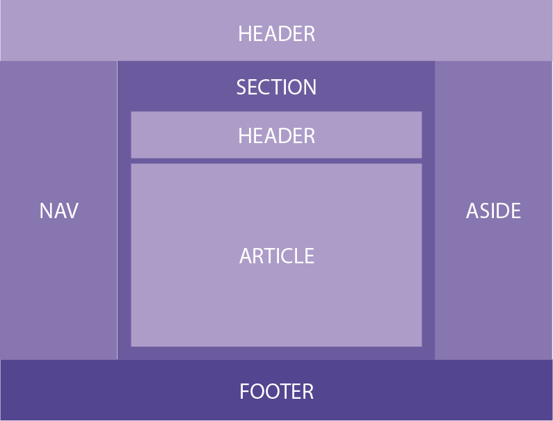
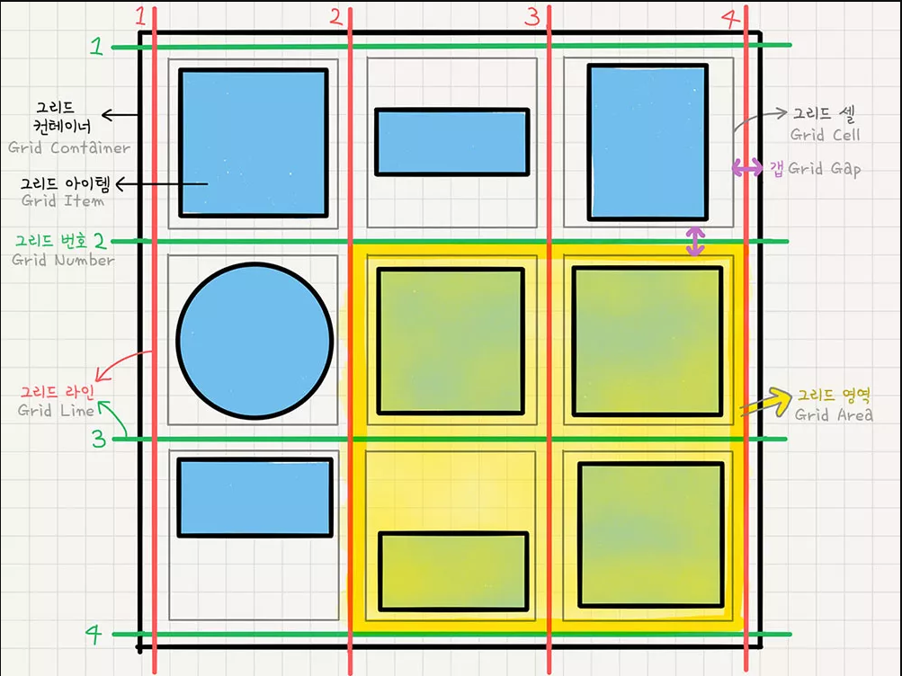

# CSS 


- 아 빌어먹을 진짜 article찾다가 오만거 다보내
> ## 태그 속성?

- 단위
    - rem : root em.    font-size 정의. 기존 px의 몇배사이즈로?
    - vh & vw : vertical height & vertical width.   
        - 뷰포트의 너비값 높이값에 맞게 맞춤.
        - 예) 브라우저 높이값 900px일때 1vh는 9px에 해당. vw동일.
    - vmin & vmax : 브라우저의 너비, 높이에따라 최대 최소 지정.
    - ex : 현재 폰트의 x-높이값, em절반값, 소문자 높이값.
    - ch : 문자수 
<br>

- 박스모델
    - margin > border > padding > content
    - top right bottom left
    - dotted    테두리 점선
    - dashed    테두리 파선
    - solid
    - double
    - groove    3차원 입체선
    - ridge     3차원 능선효과선?
    - outset    3차원 외지로 끼운선?
    - none      테두리 없음
    - hidden    테두리가 있으나 표현되지 않음.

<br>

- 테이블

```css
border: 2px solid orange;   테두리 설정.
border-spacing: 요소간 여백 설정.

```
<br>


- 배경 

```css
background-color
{ background-image: url("/dfsdf");}
{ background-repeat: repeat-x; }    배경이미지의 수평반복
                     repeat-y;                   수직반복
background-position: top left right bottom으로 조합가능.
background-attachment
```

<br>

- 텍스트

```css
color:              택스트색무
letter-spacing:     자간.
line-height         줄간격
word-spacing:       띄어쓰기 간격.
text-indent:        들여쓰기 유무.

vertical-align              수직정렬.
text-align:         left  텍스트 수평정렬.
                    right 
                    center;

text-decoration:    overline;
                    line-through;
                    underline;
                    none;       하이퍼텍스트 언더라인제거로 많이 씀.

text-transform      uppercase;      영문자 대소문자 전환.
                    lowercase;
                    capitalize;

direction:          텍스트 써지는 방향.
text-shadow         그림자 효과
white-space         여백설정.

```

<br>

- 위치속성

```css
div { z-index: 0; }     크기가 클수록 앞쪽에 위치.

div { position: static; }   정적 위치
                relative;   상대 위치
                fixed;      고정 위치; 화면스크롤시 움직이지않음
                absolute;   절대 위치
      top
      left
      right
      bottom

      clip          
      cursor        표시되는 마우스 커서모양 설정.
      
      overflow      내용(content)의 크기가 box를 넘어갈때 처리방법 결정.
      overflow-x    내용(content)의 크기가 좌우로 box를 넘어갈때 처리방법 결정.
      overflow-y    내용(content)의 크기가 로 box를 넘어갈때 처리방법 결정.


div { display: inline; }      span, a, em 등 줄바꿈없이 나란히 배치. width, height  속성 무시
                block;        div, p, h1 등 엘리먼트 하나당 1줄 차지.
                inline-block;   
                none;           요소를 나타내지 않음.
                flex;       grid때문에 잘 안씀.
                grid;

div { visibility: hidden; }     요소를 나타내지는 않으나 레이아웃 존재
                    visible;


div { opacity: 0.0 ~ 1.0 }  0에 가까울수록 투명해짐.

div { float: }

div { width: 300px; margin: auto; } 요소를 감씨는 컨테이너기준으로 수평방향 가운데정렬. 따라서 width와 함께 사용
```

<br>

> ## display: grid;
<hr>
<br>



```html
<!-- /* 부모요소 그리드 컨테이너 grid container */ -->
<div class="container">
<!-- /* 자식요소 그리드 아이템 grid item */ -->
	<div class="item">A</div>
	<div class="item">B</div>
	<div class="item">C</div>
	<div class="item">D</div>
	<div class="item">E</div>
	<div class="item">F</div>
	<div class="item">G</div>
	<div class="item">H</div>
	<div class="item">I</div>
</div>
```

```css
.container {
    display: grid;

    /* 열(column) 배치 */
    grid-template-columns: 200px 200px 500px;

    /* fr(fraction), 1 : 1 : 1 비율의 column생성. */
	grid-template-columns: 1fr 1fr 1fr 

    /* 반복횟수, 반복값 */
	grid-template-columns: repeat(3, 1fr)

    /* 고정, 가변 */
	grid-template-columns: 200px 1fr

    /* 열(column)의 최소값, 최대값, 자동 */
    grid-template-columns: repeat(3, minmax(100px, auto));

    /* 열(column)의 갯수를 확인할 수 없는경우 자동(auto) */
    grid-auto-columns: minmax(100px, auto);

    /* auto - fill, 20%크기로 최대삽입, 설정치 미만시 공간 남음  */
    grid-template-columns: repeat(auto-fill, minmax(20%, auto));

    /* auto - fit, 20%크기로 최대삽입, 설정치 이상으로 공간 채움 */
    grid-template-columns: repeat(auto-fit, minmax(20%, auto));

    /* row 간격 10px */
    row-gap: 10px

    /* column 간격 20px */
    column-gap: 20px;

    /* row 간격 10px column 간격 20px */
    gap: 10px 20px;

    /* row 간격 10px column 간격 10px */
    gap: 10px;

    /* 초기버전으로 grid- 를 붙여서 쓰기도 함. */ 
    grid-gap: 10px;


    /* 행(row) 배치 */
	grid-template-rows: 200px 200px 500px;
	grid-template-rows: 1fr 1fr 1fr
	grid-template-rows: repeat(3, 1fr)
	grid-template-rows: 200px 1fr
	grid-template-rows: 100px 200px auto
}
```

- 그리드 아이템 선택

```css
    /* 그리드 아이템 선택 */
    grid-column-start
    grid-column-end
    grid-column
    grid-row-start
    grid-row-end
    grid-row
    -ms-grid-row
    -ms-grid-column
    -ms-grid-row-span
    -ms-grid-column-span

    /* 그리드 아이템 범위 */
    .item:nth-child(1) {
        grid-column-start: 1;
        grid-column-end: 3;
        grid-row-start: 1;
        grid-row-end: 2;
}
    /* 그리드 아이템 범위 축약 */
    .item:nth-child(1) {
        grid-column: 1 / 3;
        grid-row: 1 / 2;
}
```

